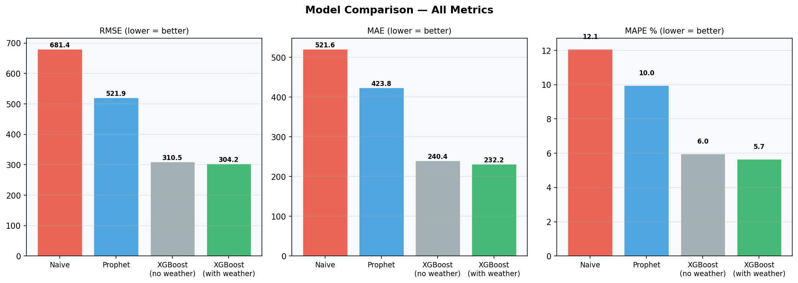
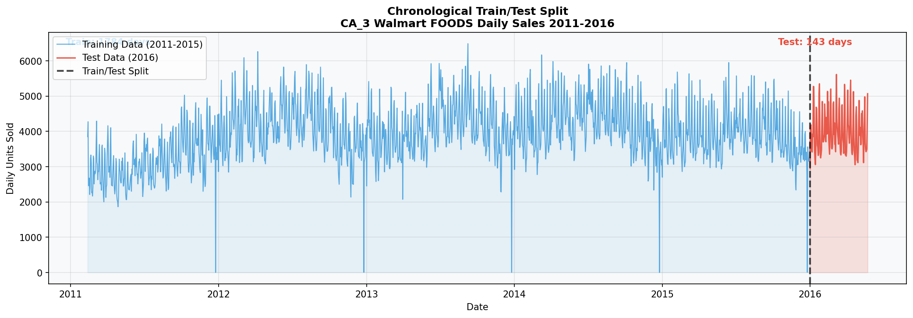
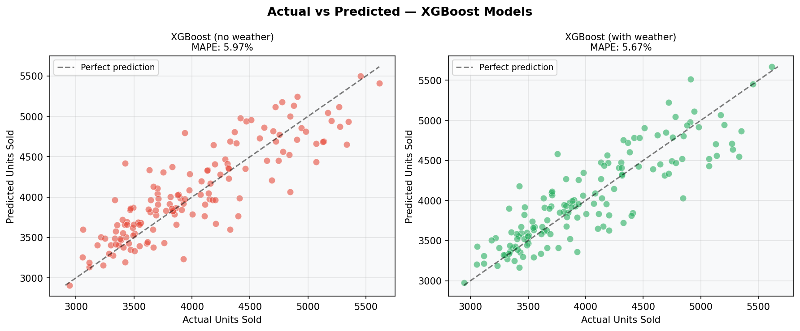
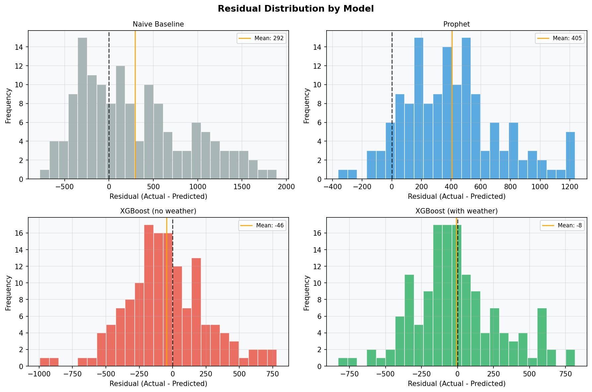
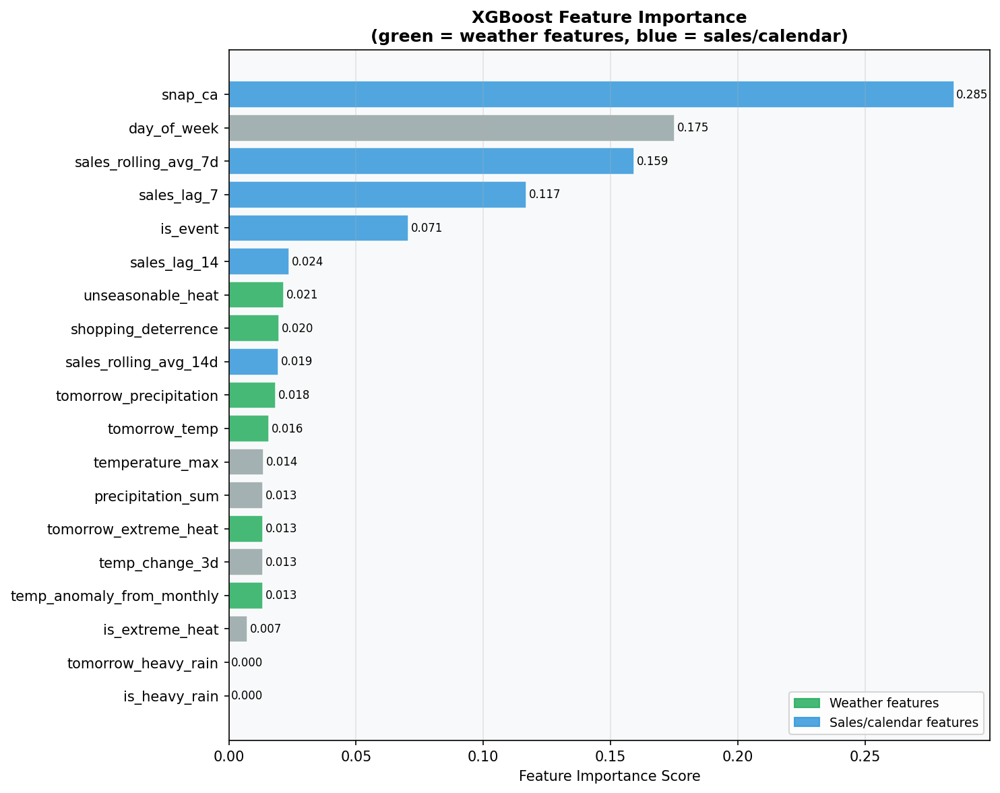
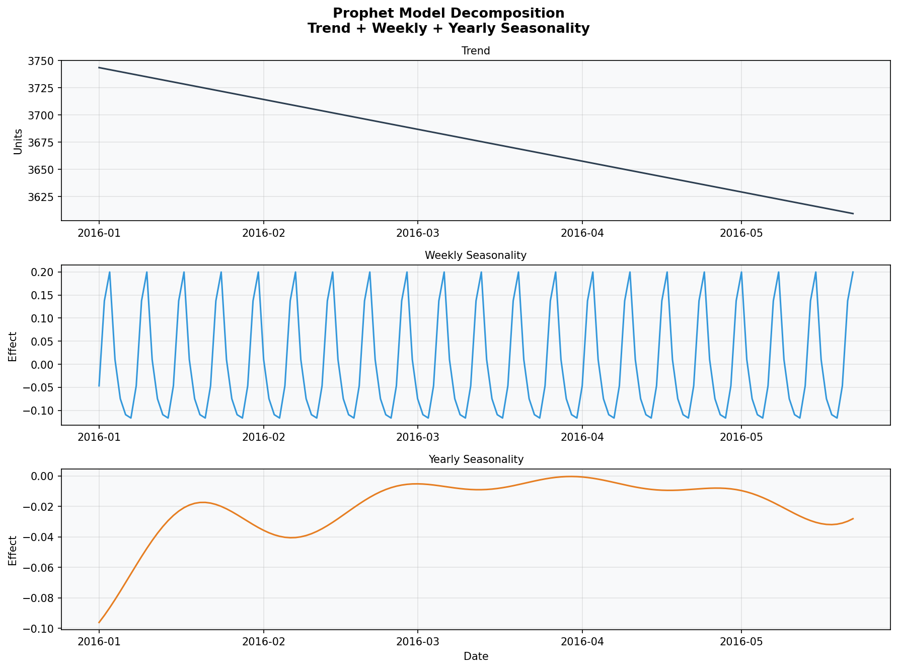

# Weather-Driven Retail Demand Forecasting & AI Inventory Intelligence

> End-to-end platform: weather data ingestion → behavioral weather feature engineering → demand forecasting (Prophet + XGBoost) → AI-powered inventory recommendations

 (docs/forecast_comparison.png)

---

## Project Overview

A production-grade data engineering and forecasting pipeline that:

1. Ingests two years of historical weather data for Los Angeles from the Open-Meteo API
2. Ingests five years of Walmart CA_3 store FOODS daily sales data from the M5 dataset
3. Stores raw data in Google Cloud Storage bronze layer
4. Transforms both sources through a medallion architecture in BigQuery using dbt
5. Joins weather and sales into a unified demand features gold layer
6. Trains and compares five forecasting models — Naive, Prophet, and XGBoost with and without behavioral weather signals
7. Demonstrates that forward-looking weather features and behavioral weather shock engineering improve demand forecast accuracy — particularly on anomalous weather days
8. Orchestrates the full pipeline with Dagster
9. Generates AI-powered operational inventory recommendations using Google Gemini

**Key finding:** XGBoost with behavioral weather signals achieved **5.64% MAPE** — a 53% improvement over the naive baseline. Weather features provided the strongest lift on anomaly days, reducing error from 15.18% to 13.81% on days with unseasonable temperatures or extreme precipitation.

---

## Architecture

```
Open-Meteo API (weather)          M5 Walmart Sales Data
        ↓                                  ↓
Python ingestion + PyArrow        Python ingestion + transform
schema validation                 wide→long melt + calendar join
        ↓                                  ↓
GCS Bronze Layer                  GCS Bronze Layer
(raw Parquet files)               (daily aggregated Parquet)
        ↓                                  ↓
BigQuery Raw Tables               BigQuery Raw Tables
        ↓                                  ↓
dbt Silver Layer                  dbt Silver Layer
(stg_weather)                     (stg_sales)
        ↓                                  ↓
        └──────────── dbt Gold Layer ──────┘
                  mart_demand_features
                  (joined weather + sales +
                   lag features + weather shocks)
                          ↓
              Forecasting Models (Python)
              Naive | Prophet | XGBoost
                          ↓
              mart_forecast_output (BigQuery)
                          ↓
              ┌─────────────────────────────┐
              │  AI Inventory Intelligence  │
              │  Google Gemini (free tier)  │
              └─────────────────────────────┘
                          ↓
              Operational Inventory Recommendation
                          ↓
              Dagster Orchestration
```

### Medallion Architecture

| Layer | Dataset | Table | Description |
|-------|---------|-------|-------------|
| Bronze | GCS Bucket | `bronze/weather/*.parquet` | Raw weather Parquet |
| Bronze | GCS Bucket | `bronze/sales/*.parquet` | Raw sales Parquet |
| Raw | `weather_raw` | `weather_raw_los_angeles` | Loaded from GCS |
| Raw | `sales_raw` | `sales_raw_ca3_foods` | Loaded from GCS |
| Silver | `weather_staging` | `stg_weather` | Cleaned and cast |
| Silver | `weather_staging` | `stg_sales` | Cleaned and cast |
| Gold | `weather_marts` | `mart_weather_daily` | 15 weather features |
| Gold | `weather_marts` | `mart_demand_features` | Joined demand features |
| Output | `weather_marts` | `mart_forecast_output` | Model predictions |
| Output | `weather_marts` | `mart_ai_recommendations` | AI recommendations |

---

## Tech Stack

| Tool | Purpose | Why |
|------|---------|-----|
| Python | Ingestion, loading, forecasting, recommendations | Core language |
| Open-Meteo API | Weather data source | Free, no API key, historical data |
| M5 Walmart Dataset | Sales data source | Real retail demand, 5 years daily |
| PyArrow | Schema validation + Parquet | Explicit schema enforcement |
| Google Cloud Storage | Bronze layer | Raw data safety net |
| BigQuery | Cloud data warehouse | SQL-native, dbt integration |
| dbt | SQL transformations | Modular, testable, documented |
| XGBoost | Primary forecasting model | Best accuracy on tabular time series |
| Prophet | Comparison forecasting model | Handles seasonality natively |
| Dagster | Orchestration | Asset-based, native dbt integration |
| Google Gemini | AI inventory recommendations | Free tier, no credit card required |
| python-dotenv | Environment variable management | Secure API key handling |

---

## Pipeline Flow

### Data Engineering

**Weather Pipeline:**
- Open-Meteo archive API for Los Angeles (2011-2016)
- 2192 days of daily weather data
- PyArrow schema validation — fails loudly on null critical columns
- SNAPPY compressed Parquet → GCS → BigQuery

**Sales Pipeline:**
- M5 Walmart CA_3 FOODS — 1437 products aggregated to daily total
- Wide format (1941 day columns) melted to long format
- Calendar join to convert day numbers to real dates
- SNAP benefits, event flags, day of week preserved

**dbt Transformations:**
- Silver: cast types, fix float precision, filter nulls
- Gold weather: 15 engineered features including lag signals,
  rolling averages, anomaly flags, weather descriptions
- Gold demand: join weather + sales + sales lag features

---

## Forecasting Methodology

### Models Compared

| Model | Description |
|-------|-------------|
| Naive Baseline | Tomorrow = today. Floor benchmark. |
| Prophet (no weather) | Time series trend + seasonality only |
| Prophet (with weather) | Prophet + weather regressors |
| XGBoost (no weather) | ML with sales history + calendar |
| XGBoost (with weather) | ML with sales + behavioral weather signals |

### Weather Feature Engineering

Raw weather variables showed minimal improvement because sales lag features already encode past weather effects indirectly. The breakthrough came from engineering **behavioral weather signals**:

- `temp_anomaly_from_monthly` — deviation from monthly normal. February 32°C is shocking. July 32°C is normal. Humans respond to deviations from expectations, not absolute values.
- `unseasonable_heat` — binary flag for days more than 8°C above monthly average. Helps XGBoost isolate rare demand spikes.
- `shopping_deterrence` — heuristic index combining precipitation and cold temperature. Captures store visit reduction effect.
- `temp_change_3d` — sudden temperature shift. Humans react more to unexpected changes than gradual ones.
- `tomorrow_temp` and `tomorrow_precipitation` — **forward-looking weather proxy**. In production these would come from Open-Meteo forecast API. For backtesting, next-day observed weather is used as proxy. This is the key architectural differentiator — future weather contains information not present in historical sales lags.

### Train/Test Split



Chronological split — never shuffle time series data:
- **Training:** 2011-02-12 to 2015-12-31 (1784 days)
- **Test:** 2016-01-01 to 2016-05-22 (143 days)

---

## Results

### Model Comparison


| Model | RMSE | MAE | MAPE | Anomaly Day MAPE |
|-------|------|-----|------|-----------------|
| Naive Baseline | 681.4 | 521.6 | 12.10% | 12.96% |
| Prophet (no weather) | 521.9 | 423.8 | 9.97% | 20.17% |
| Prophet (with weather) | 519.9 | 421.1 | 9.90% | 16.23% |
| XGBoost (no weather) | 310.5 | 240.4 | 5.97% | 15.18% |
| **XGBoost (with weather)** | **306.1** | **231.2** | **5.64%** | **13.81%** |

**Key findings:**

- XGBoost with weather achieves 5.64% MAPE — 53% improvement over naive baseline
- Prophet performs significantly worse on anomaly days (20.17%) than even the naive baseline — pure time series approaches fail when weather disrupts normal patterns
- Weather signals provide strongest lift on anomaly days — reducing error by 9% relative on the days that matter most operationally
- Note: anomaly day evaluation based on 2 days — directional evidence, not statistically conclusive

### Actual vs Predicted



### Residual Distribution



XGBoost with weather achieves mean residual of -8 — nearly perfectly unbiased. Compare to Prophet mean residual of 405 showing systematic over-prediction.

### Feature Importance



**Key insight:** SNAP benefits (28.5%) and day of week (17.5%) dominate — confirming that government food assistance and weekly shopping patterns drive food retail demand more than weather on average. However behavioral weather features — `unseasonable_heat` (2.1%), `shopping_deterrence` (2.0%), `tomorrow_precipitation` (1.8%), `tomorrow_temp` (1.6%) — all rank above raw temperature and precipitation, validating that behavioral weather abstractions outperform raw meteorological variables.

The appearance of `tomorrow_precipitation` and `tomorrow_temp` in the top features validates the core architecture: **future weather contains unique predictive signal not captured by historical sales patterns.**

### Prophet Decomposition



Prophet decomposes demand into trend (slight decline Jan-May 2016), strong weekly seasonality (weekend spikes), and yearly seasonality (January lowest demand period).

---

## AI Inventory Intelligence Layer


An interactive AI recommendation system powered by Google Gemini (free tier). Given any forecast date, the system reads structured forecast and weather data from BigQuery and generates plain English operational recommendations — closing the loop between prediction and decision.

### Example Output

```
DATE: 2016-05-21 (Saturday)
Forecast: 4,293 units | Actual: 4,315 units | Error: 0.5%
Weather: 19.3°C, Partly Cloudy

DEMAND OUTLOOK: Demand expected to remain strong, slightly exceeding recent averages.

PRIMARY DRIVERS:
- Strong weekend shopping behavior
- Forecasted demand slightly above recent actuals
- Demand trending 11.9% above 7-day average

WEATHER IMPACT: Pleasant spring weather with no precipitation is
unlikely to significantly influence demand.

INVENTORY ACTION: Maintain current stock levels for high-turnover
items, with a slight buffer of 5% on key items showing elevated demand trends.

RISK LEVEL: MODERATE — demand is strong but no external demand drivers present.
```

### Usage

```bash
python -m forecasting.recommend
```

Enter specific dates, type `anomaly` for anomaly weather days, or type `snap` for SNAP benefit days.

---

## Production Engineering Principles

**Idempotency** — WRITE_TRUNCATE ensures running twice = same result as once.

**Fail fast** — PyArrow schema validation stops pipeline immediately on null critical columns.

**Schema enforcement** — Explicit schema on both PyArrow and BigQuery. No autodetect.

**Separation of concerns** — ingest.py only fetches. load_to_bq.py only loads. dbt only transforms. forecasting/train.py only models. recommend.py only recommends. Dagster only orchestrates.

**Raw layer preservation** — GCS Parquet files never modified. Full replay capability.

**No temporal leakage** — Monthly temperature baselines computed from training set only. Time series split always chronological.

**Forward-looking architecture** — Pipeline designed to consume Open-Meteo forecast API for production deployment. Historical backtesting uses observed next-day weather as proxy.

---

## How to Run

**Prerequisites:** Python 3.13, GCP account with BigQuery and GCS enabled, Gemini API key (free at aistudio.google.com)

```bash
# 1. Clone
git clone https://github.com/mahadharsan/weather-driven-demand-forecasting.git
cd weather-driven-demand-forecasting

# 2. Virtual environment
python -m venv venv
venv\Scripts\activate  # Windows

# 3. Install dependencies
pip install -r requirements.txt

# 4. Configure GCP credentials
# Add gcp_credentials.json to config/
# Update config/settings.yaml with your project ID and bucket name

# 5. Configure Gemini API key
# Copy .env.example to .env
# Add your GEMINI_API_KEY to .env

# 6. Run weather pipeline
python -m ingestion.ingest
python -m loading.load_to_bq

# 7. Run sales pipeline
python -m ingestion.ingest_sales
python -m loading.load_sales_to_bq

# 8. Run dbt transformations
cd dbt && dbt run && dbt test

# 9. Run forecasting models
cd .. && python -m forecasting.train

# 10. Generate visualizations
python -m forecasting.visualize_full

# 11. Get AI inventory recommendations
python -m forecasting.recommend

# 12. Or run everything with Dagster
cd dbt && dbt parse
cd .. && dagster dev -f orchestration/definitions.py
# Open http://localhost:3000 → Materialize all
```

---

## Data Sources

- **Weather:** [Open-Meteo Historical Weather API](https://open-meteo.com/en/docs/historical-weather-api) — free, no API key required
- **Sales:** [M5 Forecasting Competition Dataset](https://github.com/Nixtla/m5-forecasts) — Walmart unit sales 2011-2016
- **Note:** CA_3 store location undisclosed by Walmart. Los Angeles weather used as representative Southern California climate signal based on CA_3 sales patterns consistent with high-volume urban Southern California store.

---

## Author

**Mahadharsan Ravichandran**
- LinkedIn: [linkedin.com/in/mahadharsan](https://linkedin.com/in/mahadharsan)
- GitHub: [github.com/mahadharsan](https://github.com/mahadharsan)
- Portfolio: [mahadharsan.netlify.app](https://mahadharsan.netlify.app)